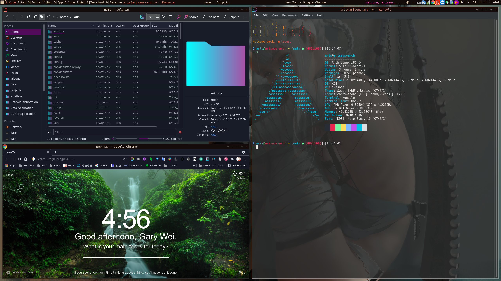

# ~/.config/awesome

Custom Awesome WM configurations



## Why Awesome WM?
1. ***Even more, why a Windows Manager?*** My main PC has 3 monitors and I open tens of windows when I'm coding or researching. Managing all windows elegantly when I'm busy catching up deadlines sucks. Therefore, a powerful WM is necessary for me.
2. **The best mouse support among all WM's!** The powerful built-in title bar allow me to drag them with my mouse. It somehow opposites the principle of WM that to use your keyboard as much as possible, but I, geeky, use Logitech G600, a mouse with 12 side key and 24 programmable keys with a G-shift key, so I use mouse a lot.
3. **Lua is not that bad.** I personally prefers python because I'm a machine learning guy but I don't repel old school languages like C or Lisp. Learning Lua is quite fun actually, much easier than when I was learning C/C++.


## Installation
``` shell
make install
```

or manually run the command
```shell
git clone --depth 1 https://github.com/lcpz/awesome-freedesktop.git ~/.config/awesome/freedesktop
git clone --depth 1 https://github.com/lcpz/lain.git ~/.config/awesome/lain
```


## Issues
1. For some reasons, it only supports 3 monitors(displays) now and fail to start if only 1 or 2 monitors is connected. Will be fixed to support 1-3 monitors soon. 
